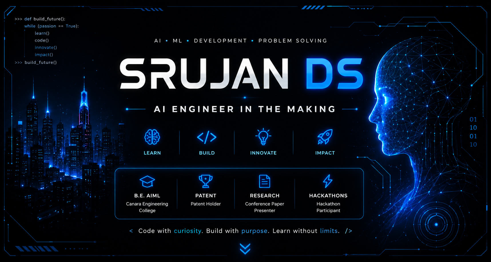

```markdown
<div align="center">

# 👋 Hi, I'm **Srujan DS**

### AI • Machine Learning • Software Development • Problem Solving



<br>


<br><br>


</div>

---

## 🚀 About Me

🎓 **B.E. in Artificial Intelligence & Machine Learning**

🏫 Canara Engineering College

💻 Passionate about **Artificial Intelligence, Machine Learning, Backend Development, and Software Engineering**

🧠 Currently sharpening my skills in:

- Data Structures & Algorithms
- Backend Development
- System Design
- Artificial Intelligence
- Machine Learning

🏆 Patent Holder

📄 Conference Paper Presenter

🚀 Hackathon Participant

🎯 **Goal:** Build intelligent software that creates real-world impact.

---

<p align="center">

</p>

# 💻 Tech Stack

<div align="center">

### Languages


<br><br>

### Technologies


<br><br>

### AI / ML

Python • Pandas • NumPy • Scikit-Learn • Matplotlib • Machine Learning • Data Analysis

</div>

---

<p align="center">

</p>

# 🚀 Featured Projects

## 🛡️ AI Fraud Call Detection

AI-powered Android application that detects fraudulent phone calls in real time.

**Tech Stack**

- Android Studio
- Firebase
- Node.js
- Python
- Azure Speech-to-Text
- Machine Learning

**Highlights**

- Live Speech Transcription
- AI Scam Detection
- Smart Warning Overlay
- Cloud Backend
- Real-Time Analysis

---

## 🌾 Smart Agriculture AI

An AI-powered recommendation system that analyzes soil nutrients and weather conditions to recommend fertilizers and help predict crop diseases.

---

## 💧 Water Potability Prediction

Machine Learning model for predicting water quality using multiple regression algorithms and data analysis techniques.

---

<p align="center">

</p>

# 📈 GitHub Statistics

<div align="center">


</div>

---

# 📊 Most Used Languages

<div align="center">


</div>

---

# 📈 Contribution Graph

<div align="center">


</div>

---

# 🏆 GitHub Trophies

<div align="center">


</div>

---

<p align="center">

</p>

# 🌱 Currently Learning

- Advanced Data Structures & Algorithms
- Backend Development
- Database Design
- System Design
- Artificial Intelligence
- Machine Learning
- Open Source Contribution

---

# 🏅 Achievements

🏆 Patent Holder

📄 Conference Paper Presenter

🚀 Hackathon Participant

💡 Builder of AI-powered real-world applications

---

# 📫 Connect With Me

<div align="center">

<a href="mailto:srujan2182005@gmail.com">

</a>

&nbsp;&nbsp;&nbsp;

<a href="https://www.linkedin.com/in/srujan-ds-76615b2a4">

</a>

&nbsp;&nbsp;&nbsp;

<a href="https://github.com/DsSrujan">

</a>

</div>

---

# 💭 Quote

<div align="center">

### *"Code with curiosity. Build with purpose. Learn without limits."*

</div>

---

<div align="center">


### ⭐ Thanks for visiting my profile!

</div>
```
