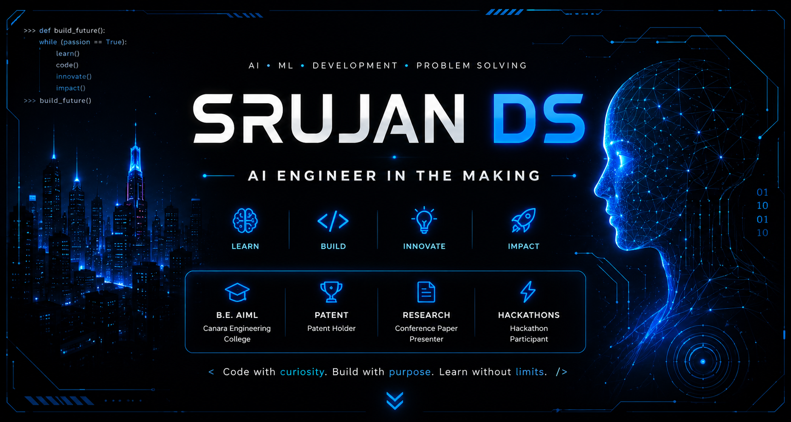

<div align="center">

</div>

<div align="center">

&nbsp;&nbsp;🔴&nbsp;🟡&nbsp;🟢&nbsp;&nbsp;**~/srujan-ds — zsh**

```
srujan@github ~$ ./whoami.sh
```


</div>

```
> NAME       Srujan DS
> ROLE       AI/ML Student · Backend Developer
> EDUCATION  B.E. Artificial Intelligence & Machine Learning
> SCHOOL     Canara Engineering College
> STATUS     Patent Holder · Conference Paper Presenter · Hackathon Participant
> FOCUS      DSA · Backend Dev · ML · System Design
```

<div align="center">

&nbsp;&nbsp;🔴&nbsp;🟡&nbsp;🟢&nbsp;&nbsp;**~/skills — zsh**

```
srujan@github ~$ ls skills/
```


`AI / ML   →   Python · Pandas · NumPy · Scikit-Learn · Matplotlib`

</div>

<div align="center">

&nbsp;&nbsp;🔴&nbsp;🟡&nbsp;🟢&nbsp;&nbsp;**~/projects — zsh**

```
srujan@github ~$ ls -la projects/ --all
```

<table>
<tr>
<td width="50%" valign="top">

**🛡️ AI Fraud Call Detection**  
Android app that detects fraudulent calls in real time using speech recognition + ML.  
`stack: Python, ML, Android`

</td>
<td width="50%" valign="top">

**🌾 Smart Agriculture AI**  
Fertilizer recommendation + crop disease prediction from soil & weather data.  
`stack: Python, ML`

</td>
</tr>
<tr>
<td width="50%" valign="top">

**💧 Water Potability Prediction**  
Predicts water quality using preprocessing + regression models.  
`stack: Python, Scikit-Learn`

</td>
<td width="50%" valign="top">

**🏆 Patent + Conference Paper**  
Holder of a filed patent; presented original research at a technical conference.  
`status: published / filed`

</td>
</tr>
</table>

</div>

<div align="center">

&nbsp;&nbsp;🔴&nbsp;🟡&nbsp;🟢&nbsp;&nbsp;**~/stats — zsh**

```
srujan@github ~$ git log --stats --all
```


</div>

<div align="center">

&nbsp;&nbsp;🔴&nbsp;🟡&nbsp;🟢&nbsp;&nbsp;**~/contact — zsh**

```
srujan@github ~$ cat contact.json
```

```json
{
  "email": "srujan2182005@gmail.com",
  "linkedin": "linkedin.com/in/srujan-ds-76615b2a4",
  "github": "github.com/DsSrujan"
}
```

<a href="mailto:srujan2182005@gmail.com"></a>
&nbsp;&nbsp;
<a href="https://www.linkedin.com/in/srujan-ds-76615b2a4"></a>
&nbsp;&nbsp;
<a href="https://github.com/DsSrujan"></a>

<br><br>

`$ echo "Code with curiosity. Build with purpose. Learn without limits."`


</div>
