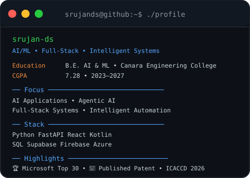

<table>
<tr>
<td valign="top">

</td>
<td valign="top">

</td>
</tr>
</table>

<h1>Srujan D S</h1>

<h3>AI/ML Engineer • Full-Stack Developer • Agentic Systems</h3>

&nbsp;

&nbsp;

&nbsp;

<h2 align="center">🧠 About Me</h2>

<table align="center">
<tr>
<td>

I am an Artificial Intelligence & Machine Learning undergraduate at Canara Engineering College, focused on building practical AI systems, intelligent automation workflows, and scalable full-stack applications.

My work combines machine learning, speech recognition, Agentic AI, real-time systems, and web/mobile development — taking models beyond notebooks and turning them into usable applications.

🏆 Top 30 Finalist — National-Level Microsoft Hackathon
⭐ UDBHAVA 2025 Appreciation Award
📜 Published Patent — Adaptive Machine-Learning System for Detecting and Filtering Fraudulent Calls
🎤 ICACCD 2026 Conference Presenter

Currently looking for: AI/ML Engineer · Full-Stack Developer Intern · AI Research Intern

</td>
</tr>
</table>

<h2 align="center">💼 Currently</h2>

<table align="center">
<tr>
<td>

Web Developer Intern — Samriddhi Organics

Working on full-stack web development using React, Tailwind CSS and Supabase.

Building and deploying dynamic web applications

Implementing Email/Password and Google OAuth authentication

Working with Supabase real-time backend state management

Designing secure database workflows using triggers and Row-Level Security

Improving responsive interfaces and core user workflows

</td>
</tr>
</table>

<h2 align="center">🚀 Featured Projects</h2>

<table align="center">
<tr>
<td width="50%" valign="top">

🛡️ Real-Time Fraud Detection System

AI system for identifying potential phone-call scams using speech recognition and real-time conversation analysis.

Stack

Python Node.js Azure Speech Twilio Firebase

Highlights

Real-time speech-to-text transcription

Twilio conferencing integration

Scalable Python/Node.js backend

Published patent associated with the system

</td>

<td width="50%" valign="top">

🎙️ AI Interview Simulator

AI-powered interview platform that analyzes resumes and dynamically generates technical interview questions.

Stack

FastAPI React Python Supabase Groq API

Highlights

PDF resume parsing

Tailored technical questions

Adaptive follow-up algorithm

Real-time conversational interview flow

</td>
</tr>

<tr>
<td width="50%" valign="top">

🌾 AI Soil Intelligence System

Android application for diagnosing agricultural soil conditions and generating intelligent recommendations.

Stack

Kotlin Python FastAPI Random Forest XGBoost

Highlights

Soil NPK, pH and micronutrient analysis

Crop deficiency diagnosis

Fertilizer recommendation

Weather-aware application timelines

</td>

<td width="50%" valign="top">

🧰 Omni-Tool Kit

A modular developer utility platform designed to simplify common automation, conversion, API testing and processing workflows.

Stack

Python REST APIs Automation

Highlights

Modular utilities

Developer-focused workflows

Data processing and conversion tools

API-oriented architecture

</td>
</tr>
</table>

<h2 align="center">🛠️ Tech Stack</h2>

 

<table align="center">
<tr>
<th>Area</th>
<th>Technologies</th>
</tr>
<tr>
<td><b>AI / ML</b></td>
<td>Machine Learning · Scikit-learn · XGBoost · Pandas · NumPy · Agentic AI</td>
</tr>
<tr>
<td><b>Languages</b></td>
<td>Python · SQL · Java · Kotlin · JavaScript · HTML · CSS</td>
</tr>
<tr>
<td><b>Backend & APIs</b></td>
<td>FastAPI · Node.js · REST APIs · Azure Speech Services · Twilio</td>
</tr>
<tr>
<td><b>Databases</b></td>
<td>MySQL · Firebase · Supabase</td>
</tr>
<tr>
<td><b>Frontend & Mobile</b></td>
<td>React · Tailwind CSS · Android Studio · Kotlin</td>
</tr>
<tr>
<td><b>Tools</b></td>
<td>Git · GitHub · VS Code · Google Colab</td>
</tr>
</table>

<h2 align="center">🏅 Competitions & Recognition</h2>

<table align="center">
<tr>
<th></th>
<th>Event / Organization</th>
<th>Recognition</th>
</tr>
<tr>
<td>🏆</td>
<td><b>National-Level Microsoft Hackathon</b></td>
<td><b>Top 30 Finalist</b></td>
</tr>
<tr>
<td>⭐</td>
<td><b>UDBHAVA 2025</b> — 24-hour Hackathon, Nitte</td>
<td><b>Appreciation Award</b></td>
</tr>
<tr>
<td>🛡️</td>
<td><b>CyberSiege 2026</b></td>
<td>24-hour CTF Competitor</td>
</tr>
<tr>
<td>⚡</td>
<td><b>Hackfest CTF 2026 — Nitte</b></td>
<td>CTF Competitor</td>
</tr>
<tr>
<td>🚀</td>
<td><b>AINNOVATION 2025</b></td>
<td>24-hour Hackathon Participant</td>
</tr>
<tr>
<td>🔥</td>
<td><b>Core Unleashed 2026</b></td>
<td>36-hour Hackathon Participant</td>
</tr>
</table>

<h2 align="center">🎖️ Certifications & Badges</h2>

<table align="center">
<tr>
<td align="center">

 

<b>IBM SkillsBuild</b>

</td>
<td align="center">

 

<b>AINNOVATION 2025</b>

</td>
</tr>
</table>

<h2 align="center">📊 GitHub Activity</h2>

  

<h2 align="center">🐍 Contribution Activity</h2>

<picture>
  <source media="(prefers-color-scheme: dark)"
          srcset="https://raw.githubusercontent.com/DsSrujan/DsSrujan/output/github-contribution-grid-snake-dark.svg"/>
  <source media="(prefers-color-scheme: light)"
          srcset="https://raw.githubusercontent.com/DsSrujan/DsSrujan/output/github-contribution-grid-snake.svg"/>
  
</picture>

<h2 align="center">📬 Let's Connect</h2>

I'm actively looking for AI/ML and Full-Stack opportunities.

 

  

Building intelligent systems, one commit at a time.

 

